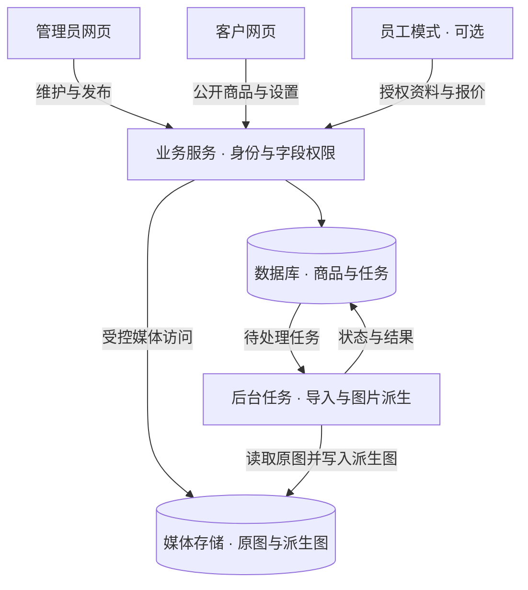

# 技术蓝图

以下是从参考项目提炼的默认路线，目的是减少无谓选型。使用者可替换任一技术，AI 应记录替换理由，并保留选中功能所需的业务边界。

## 默认组成

| 层次 | 参考选择 | 责任 |
|---|---|---|
| 管理网页 | Vue 3 + TypeScript | 商品、草稿、导入、价格、账号与设置；桌面效率优先 |
| 客户与员工网页 | Vue 3 + TypeScript | 手机优先；员工登录后读取授权接口 |
| 业务服务 | NestJS + TypeScript | 身份、字段权限、发布、价格与任务写入 |
| 数据库 | PostgreSQL + Prisma | 关系、约束、事务、迁移与任务状态 |
| 图片处理 | Sharp + 独立 worker | 旋转、缩放、编码、派生状态与重试 |
| 代码组织 | pnpm workspaces | 应用与契约分别维护；依赖锁定与统一检查 |
| 初期存储 | 本地持久化目录 + storage adapter | 数据与媒体可备份，后续可替换对象存储 |

不要机械选择“最新版本”。根据目标设备、依赖兼容性和部署方式选择实际可安装的版本；在新项目锁定版本并记录构建结果。

## 系统关系



图中的员工能力按需实现。一个人经营时，客户展示和管理员维护就可以组成完整闭环。旧项目的专用小程序、临时公网隧道和发布环境不属于新项目的默认依赖。

可编辑图表另存为[架构图源码](../架构图.mmd)。

## 建议目录

这是让 AI 在新项目创建的结构，本仓库没有这些应用代码。

```text
apps/
  admin-web/          # 管理界面
  client-web/         # 客户界面与可选员工模式
  api/               # 服务端、数据库迁移、worker 入口
packages/
  contracts/         # 分角色请求与响应契约
infra/               # 可复现的构建、启动、备份说明
scripts/             # 初始化、虚构样例、验证入口
docs/                # 该项目自己的需求、决策与验收记录
```

不要为了共用类型而把含进价的数据库对象直接返回给客户。契约可以共享商品标识等基础结构，客户、员工和管理员响应分别定义。

## 四条关键数据流

**图片：** 接收上传 → 校验大小、格式和解码结果 → 保存原图 → 创建处理任务 → worker 生成展示图与缩略图 → 标记 READY。初始参考尺寸为缩略图最长边 480px、展示图最长边 1600px，保持比例并处理旋转；尺寸和编码可按新项目调整。原图只用于处理或归档，公开页面走受控派生图入口。

**发布：** 保存草稿 → 校验必填项、版本和图片状态 → 在事务中让正式内容及其关联一起生效。图片文件生成发生在事务外；发布事务只引用已就绪的资源。正式改价有独立入口，避免编辑描述时意外重算价格。

**导入（可选）：** 读取表格与匹配规则 → 形成预检结果 → 使用者处理异常 → 确认应用 → 创建或更新草稿及媒体任务。重复请求必须可识别；一个失败批次要能看出哪些步骤已经落库。

**报价（可选）：** 恢复或创建员工自己的草稿 → 读取被授权商品与价格 → 编辑清单 → 带幂等标识提交 → 保存不可变的报价快照 → 生成可分享结果。网络超时后先按同一标识查结果，避免重复生成正式报价。

## 为什么初期可以轻量

图片任务用数据库任务表加独立 worker 起步，明确状态、重试次数、租约、心跳与幂等。只有当前任务量或可靠性需求表明不足时，再评估独立队列服务。

先支持单店铺；不同角色共用数据但分开权限。对象存储、多店铺等通过明确边界扩展，不必首期把全部平台能力建出来。

## 运行与迁移

新项目应提供本地开发路径，以及使用者需要时的服务器部署路径。可推荐 Docker Compose 统一运行应用、数据库和 worker；也可按设备条件原生运行，不能强迫不支持的设备安装特定软件。

配置按用途分开：公开店铺设置、服务运行参数、秘密凭证。提供无秘密的配置示例和启动前校验，凭证在目标环境生成。管理员首次初始化使用安全交互或一次性初始化流程，避免固定通用密码。

数据库与媒体使用可定位的持久化存储。备份覆盖数据库、关联媒体和必要配置；凭证另作受限管理。恢复先在新目录或新实例演练，核对商品、图片、权限和启动状态。镜像存在或备份哈希正确，均不等于已经验证恢复成功。

公网域名、HTTPS、服务器写入和持续费用在正式部署前明确处理；本地阶段可停留在回环地址。AI 应尊重使用者现有网络和服务，不为部署试错改动其他系统。
